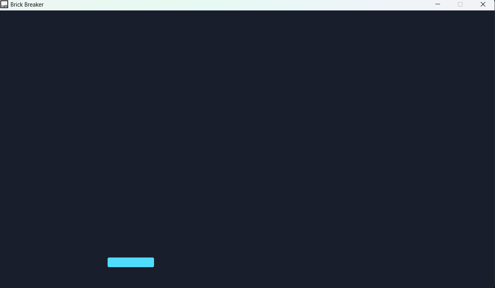
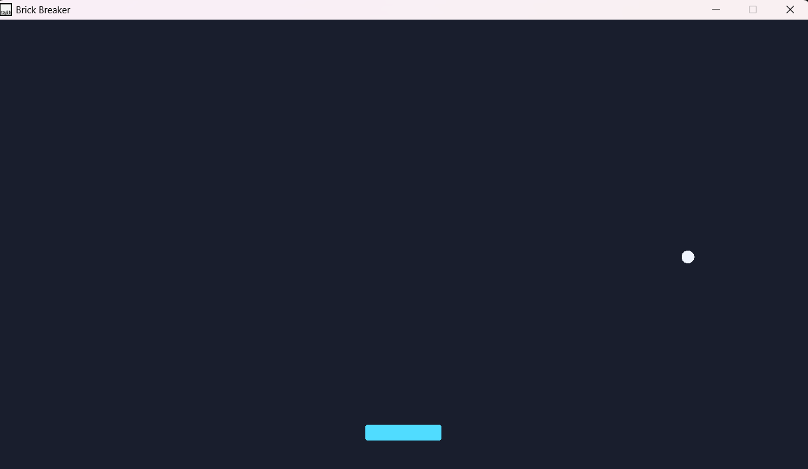
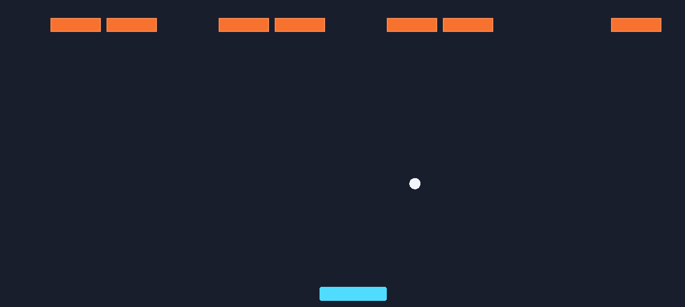
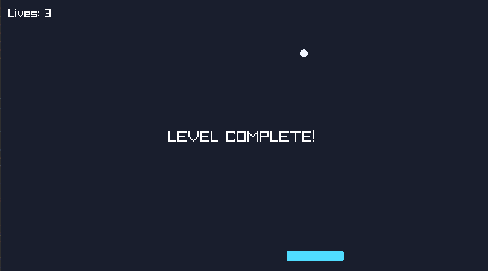
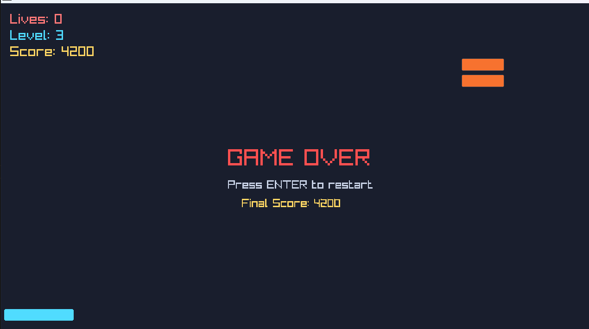

# Brick Breaker

A Brick Breaker clone built completely from scratch in C++ using Raylib.

## Tech Stack

* C++17
* Raylib
* Git
* GitHub

## Goals

* Implement game architecture
* Implement object-oriented design
* Build reusable game systems

## Current Progress

### Milestone 0 - Project Setup

* Git repository created
* GitHub repository created
* Raylib configured
* Window creation implemented
* 1280 x 720 game window
* 120 FPS game loop

### Milestone 1 - Paddle

Completed:

* Paddle class created
* Rounded paddle rendering implemented 
* Frame-independent paddle movement implemented using delta time
* Screen boundary clamping implemented

### Milestone 2 - Game Architecture & Ball

Completed:

* Game class created
* Input handling moved into Game
* Ball class created
* Ball rendering implemented
* Frame-independent ball movement implemented
* Ball-wall collision detection and reflection implemented
* Game class now composes and manages all gameplay entities:
  - Paddle (ownership, input handling, update/draw delegation)
  - Ball (ownership, frame-independent movement, collision detection)

### Milestone 3 - Paddle-Ball Collision

Completed:

* Paddle-ball collision detection & response system implemented
* Dynamic bounce angles and ball repositioning based on impact position implemented
* Constant ball speed preserved across paddle collisions
* Collision filtering and Center-hit loop prevention implemented

### Milestone 4 - Bricks & Brick Destruction

Completed:

* Brick class created
* Brick rendering implemented
* Multiple brick management and brick field generation implemented using std::vector
* Ball-brick collision detection implemented (top, bottom & side collisions)
* Brick destruction system implemented
* Brick state management implemented using alive/dead states
* Ball penetration prevention implemented using previous-position tracking
* First partial playable gameplay loop 


### Milestone 5 - Win/Lose Gameplay Loop

Completed:

* Lives system implemented
* Ball launch mechanic implemented
* Ball remains attached to paddle before launch
* Ball reset system implemented after life loss
* Level completion state implemented
* Game over state implemented
* Complete win/lose gameplay loop implemented
* First playable version of Brick Breaker achieved

### Milestone 6 - Level Progression

Completed:

* Multi-level architecture implemented
* Reusable brick placement helper implemented
* Three unique level layouts implemented
* Automatic level progression implemented
* Paddle and ball reset between levels implemented
* Level counter UI implemented
* Complete multi-level gameplay progression achieved

### Milestone 7 - Score & Restart System

Completed:

* Score system implemented
* Brick and level completion rewards implemented
* Restart system implemented
* Complete gameplay reset flow implemented
* Final score display implemented
* Win/Lose screen instructions implemented
* Ball launch speed progression implemented
* Gameplay difficulty scaling implemented

### Milestone 8 - Game Feel & Polish

Completed:

* Row-based brick coloring implemented
* Sound effects implemented for:
  - Paddle collisions
  - Brick destruction
  - Level completion
  - Game over
* Particle system for brick destruction implemented
* Particle lifetime management with brick-colored particle bursts implemented
* Improved gameplay feedback and visual polish

## Screenshots

### Milestone 1 - Paddle



### Milestone 2 - Ball




### Milestone 4 - Bricks


### Milestone 5 - Game-Over


### Milestone 7 - Score & Restart


## Planned Features

### Core Gameplay

* High score tracking
* Additional brick types
* Difficulty balancing

### Game Systems

* High score tracking
* Save/load support
* Settings menu

### Polish

* Screen shake
* UI/UX improvements
* Improved visual effects
* Power-ups

### Stretch Goals

* Level editor
* Additional power-up types
* Level loading from files

## Repository Structure

```text
src/
    ├── main.cpp
    ├── game.hpp
    ├── game.cpp
    ├── paddle.hpp
    ├── paddle.cpp
    ├── ball.hpp
    ├── ball.cpp
    ├── brick.hpp
    └── brick.cpp 
```
