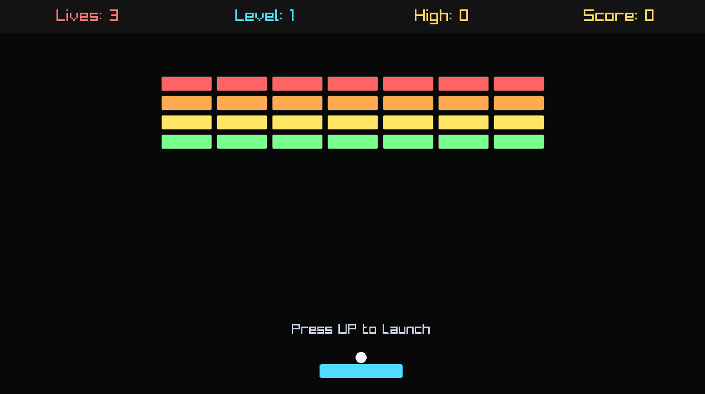
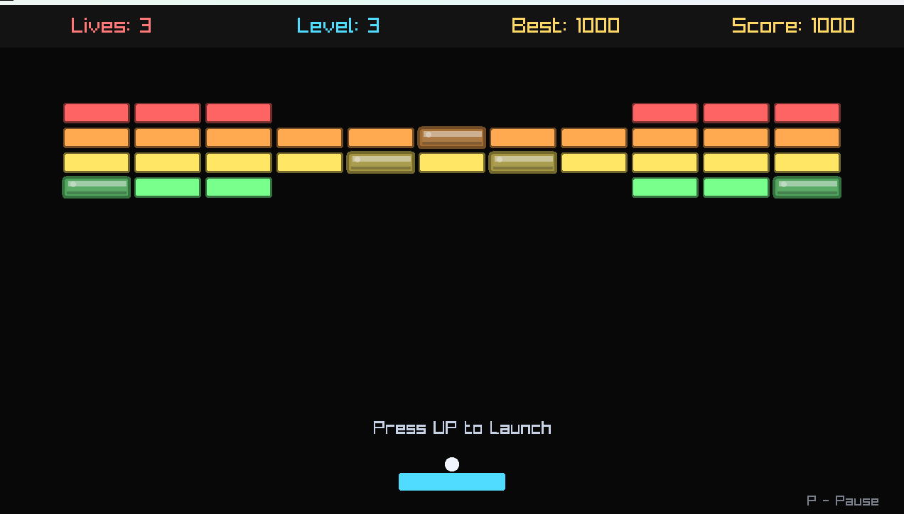
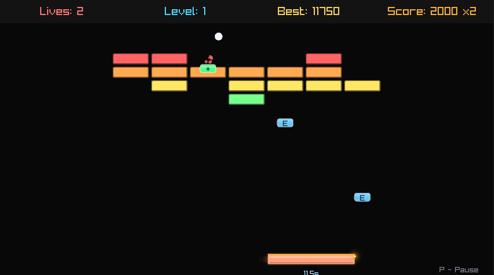

# Brick Breaker

A Brick Breaker clone built completely from scratch in C++ using Raylib.

## Tech Stack

* C++17
* Raylib
* Git

## Goals

* Implement game architecture
* Implement object-oriented design
* Build reusable game systems

## Current Progress

### Milestone 0 - Project Setup

* Git repository created
* GitHub repository created
* Raylib configured
* Window creation implemented
* 1280 x 720 game window
* 120 FPS game loop

### Milestone 1 - Paddle

Completed:

* Paddle class created
* Rounded paddle rendering implemented 
* Frame-independent paddle movement implemented using delta time
* Screen boundary clamping implemented

### Milestone 2 - Game Architecture & Ball

Completed:

* Game class created
* Input handling moved into Game
* Ball class created
* Ball rendering implemented
* Frame-independent ball movement implemented
* Ball-wall collision detection and reflection implemented
* Game class now composes and manages all gameplay entities:
  - Paddle (ownership, input handling, update/draw delegation)
  - Ball (ownership, frame-independent movement, collision detection)

### Milestone 3 - Paddle-Ball Collision

Completed:

* Paddle-ball collision detection & response system implemented
* Dynamic bounce angles and ball repositioning based on impact position implemented
* Constant ball speed preserved across paddle collisions
* Collision filtering and Center-hit loop prevention implemented

### Milestone 4 - Bricks & Brick Destruction

Completed:

* Brick class created
* Brick rendering implemented
* Multiple brick management and brick field generation implemented using std::vector
* Ball-brick collision detection implemented (top, bottom & side collisions)
* Brick destruction system implemented
* Brick state management implemented using alive/dead states
* Ball penetration prevention implemented using previous-position tracking
* First partial playable gameplay loop 

### Milestone 5 - Win/Lose Gameplay Loop

Completed:

* Lives system implemented
* Ball launch mechanic implemented
* Ball remains attached to paddle before launch
* Ball reset system implemented after life loss
* Level completion state implemented
* Game over state implemented
* Complete win/lose gameplay loop implemented
* First playable version of Brick Breaker achieved

### Milestone 6 - Level Progression

Completed:

* Multi-level architecture implemented
* Reusable brick placement helper implemented
* Three unique level layouts implemented
* Automatic level progression implemented
* Paddle and ball reset between levels implemented
* Level counter UI implemented
* Complete multi-level gameplay progression achieved

### Milestone 7 - Score & Restart System

Completed:

* Score system implemented
* Brick and level completion rewards implemented
* Restart system implemented
* Complete gameplay reset flow implemented
* Final score display implemented
* Win/Lose screen instructions implemented
* Ball launch speed progression implemented
* Gameplay difficulty scaling implemented

### Milestone 8 - Game Feel & Polish

Completed:

* Row-based brick coloring implemented
* Sound effects implemented for:
  - Paddle collisions
  - Brick destruction
  - Level completion
  - Game over
* Particle system for brick destruction implemented
* Particle lifetime management with brick-colored particle bursts implemented
* Screen shake system implemented for gameplay feedback
* HUD redesign implemented
* Horizontal score/lives/level display implemented
* Launch instruction system implemented
* Improved gameplay feedback and visual polish achieved

### Milestone 9 - UI & UX Overhaul

Completed:

* Pause system and pause overlay implemented
* High score tracking implemented
* Brick destruction statistics implemented
* HUD layout redesigned and aligned using a four-column structure
* Reusable overlay, centered-text & end-screen rendering systems implemented
* Input handling refactored into dedicated helper functions
* Improved game-over and victory screens
* Improved readability and ux achieved

### Milestone 10 - Advanced Brick Types

Completed:

* BrickType architecture implemented
* Strong brick - Two-hit destruction mechanic implemented
* Strong brick visual state & placement integrated into all levels
* Armor-break feedback system implemented
  - Armor-break sound effect
  - Armor-break particle effects
  - Damage-based screen shake
* Bonus scoring for damaging strong bricks implemented
* Persistent high score saving implemented
* Victory sound implemented
* Level difficulty progression improved through brick variety

### Milestone 11 - Menu & Game Flow System

Completed:

* Main menu implemented with input handling
* Game now starts in menu state
* State-driven game flow architecture implemented
* Pause menu redesigned & pause statistics display implemented
* Main menu navigation added to pause screen and end screens.
* Persistent high score displayed in menus
* Game state transitions centralized
* Complete game flow system achieved

### Milestone 12 - Power-Up System

Completed:

* PowerUp class implemented
* PowerUpType architecture introduced
* Falling collectible system implemented
* Random power-up spawning from destroyed bricks
* Expand-Paddle power-up implemented
* Extra Life power-up implemented
* Temporary timer effect for the exapanded-paddle implemented
* Power-up status display, collection and cleanup implemented
* Gameplay variety and reward mechanics significantly improved
* Weighted power-up spawning implemented
* Power-up balancing and spawn restrictions added
* Overdrive power-up implemented
* Overdrive gameplay effects:
  - Increased paddle speed
  - Increased ball speed
  - Score multiplier
* Overdrive visual feedback system implemented:
  - Energy trail effects
  - Animated paddle glow
  - Dynamic overdrive coloring
  - Clockwise perimeter fuse countdown
  - Moving spark indicator
  - Critical-state warning effects
  - Color transition as timer expires
* Power-up balancing and spawn restrictions added
* Gameplay variety and reward mechanics significantly improved

### Milestone 12.5 - Overdrive Visual Overhaul

Completed:

* Animated overdrive visual system implemented
* Clockwise perimeter fuse countdown implemented
* Dynamic spark traversal implemented
* Paddle energy trail effects implemented
* Color-transition warning system implemented
* Critical-state visual feedback implemented
* Overdrive gameplay state significantly enhanced

### Milestone 13.1 — Project Architecture Refactor

Completed:

* Source files reorganized into dedicated modules
* Game and entity code separated into folders
* Modular project structure introduced
* Build system updated for scalable architecture
* Compiler toolchain migrated to w64devkit
* Include paths reorganized
* Build pipeline modernized
* Foundation established for future system extraction

### Milestone 13.2 — Game Architecture Cleanup

Completed:

* Game member variawbles grouped by responsibility
* Gameplay, audio, entities, UI, and effects sections introduced
* Game functions organized into logical subsystems
* Collision, level, power-up, UI, and persistence responsibilities separated
* Header documentation added
* Centralized constants system introduced
* UI colors moved to shared constants
* Gameplay balancing constants extracted
* Overdrive configuration centralized
* Reduced magic numbers and duplicated values
* Improved maintainability and readability

## Screenshots

### Milestone 1 - Paddle

### Milestone 2 - Ball

### Milestone 4 - Bricks

### Milestone 5 - Game-Over

### Milestone 7 - Score & Restart

### Milestone 9 - UI & UX Overhaul

### Milestone 10 - Advanced Brick Type - I (strong brick)

### Milestone 12 - Power-Ups

## Planned Features

### Core Gameplay

* Additional power-up types
* Additional brick types
* Difficulty balancing

### Architecture

* Particle system extraction
* HUD renderer extraction
* Power-up manager
* Level manager
* Additional game states

### Polish

* Ball motion trails
* Impact feedback effects
* Additional particle systems
* Pause menu enhancements
* Visual theme improvements

### Stretch Goals

* Level editor
* Additional power-up types
* Level loading from files
* Power-ups

## Project Statistics

* ~1,800+ lines of C++ code
* 13 completed milestones
* 5 game states
* 3 power-up types
* 2 brick types
* 3 playable levels
* Advanced visual feedback systems

## Repository Structure

Brick Breaker/
│
├── assets/
│   └── sounds/
│
├── data/
│   └── highscore.txt
│
├── screenshots/
│
├── src/
│   │
│   ├── main.cpp
│   │
│   ├── core/
│   │   └── constants.hpp
│   │
│   ├── game/
│   │   ├── game.hpp
│   │   └── game.cpp
│   │
│   ├── entities/
│   │   ├── paddle.hpp
│   │   ├── paddle.cpp
│   │   ├── ball.hpp
│   │   ├── ball.cpp
│   │   ├── brick.hpp
│   │   ├── brick.cpp
│   │   ├── powerup.hpp
│   │   └── powerup.cpp
│   │
│   ├── managers/
│   │
│   └── states/
│
├── README.md
├── Makefile
└── .gitignore